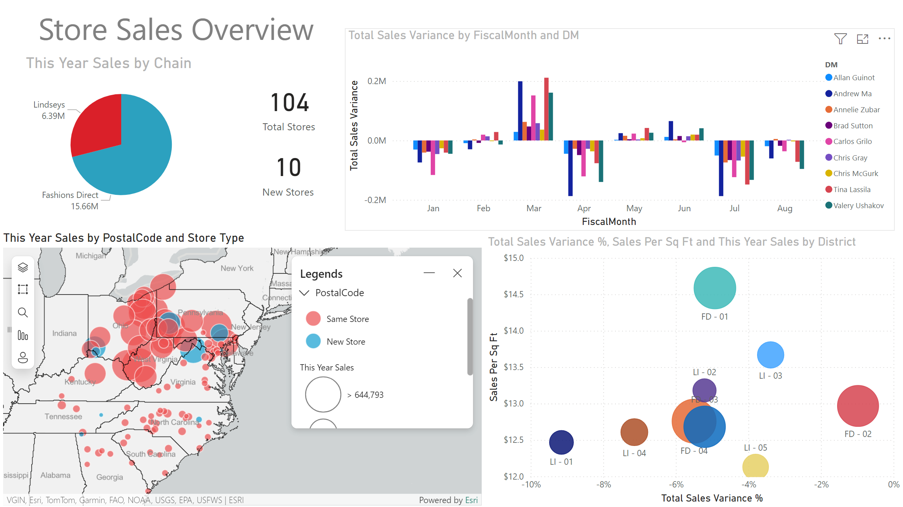
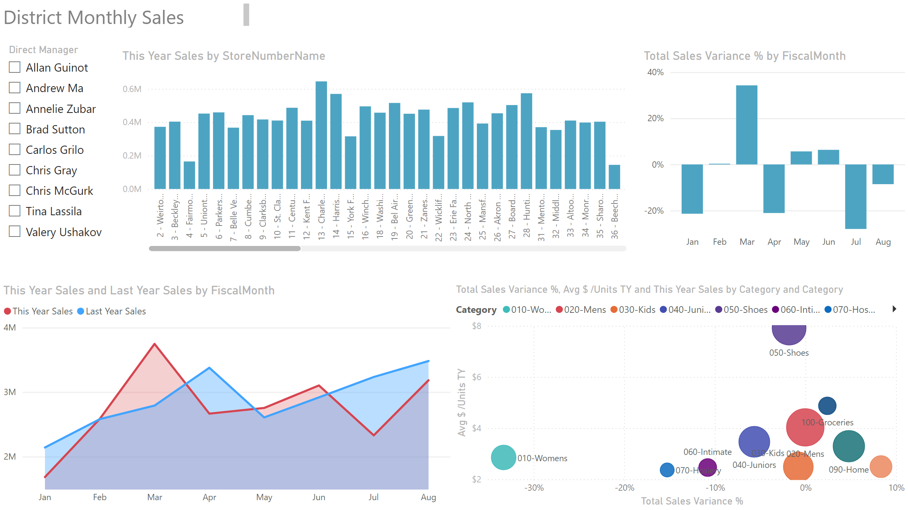
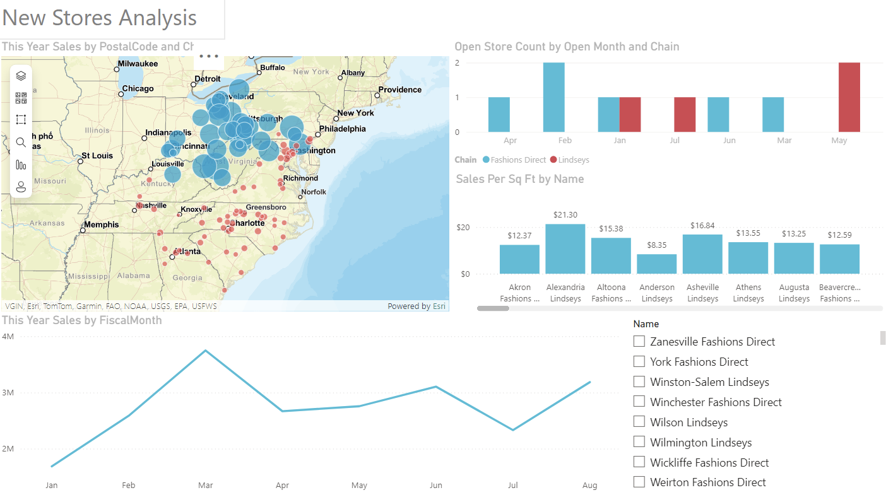

<picture>
 <source media="(prefers-color-scheme: dark)" srcset="githubBanner/DarkModeBanner.png">
 <source media="(prefers-color-scheme: light)" srcset="githubBanner/LightModeBanner.png">
  phquy.0127@gmail.com, <Phone Number> +84 38-588-4754 " src="githubBanner/DefaultModeBanner.png">
</picture>

# Hi there 👋🏻
Good morning or good evening, depending on your time of day!

## Project Overview
This repository contains the documentation for a hands-on PowerBI project as part of the NC296 class orgainized by the Universiy of Science. The goal of the projects is to design data models, create measures, and develop insightful visualization using retail sales data.

I have completed three main dashboards:
Three main dashboards were developed for this project:
<ol>
<li><b>Store Sales Overview:</b>
This dashboard provides an overall view of store performance, including total sales, sales variance, and sales distribution across various store types and chains.

<em>A summary of sales performance across all stores, with visualizations highlighting key metrics such as total sales, total sales variance, and average sales per unit.</em>

 </li>
<li><b>District Monthly Sales:</b>
This report visualizes sales performance across different districts on a monthly basis. It highlights sales trends, comparing current and previous year sales, and includes variance analysis.

 <em>Focuses on district-level performance, providing a monthly breakdown of sales by district. Key metrics like sales variance and district comparisons are visually represented.</em>

</li>
<li><b>New Stores Analysis</b>

This dashboard explores new store openings, their impact on sales, and geographical distribution. It includes a map visualization of store locations, a breakdown of sales by month, and an analysis of sales per square foot.

<em> Analyzes the performance of new stores, with visualizations showing open store counts, sales per square foot, and sales by postal code and chain.</em>

 </li>
</ol>

## Data Description
The project utilizes a sample Retail Analysis dataset, including details on districts, items, stores, sales, and time periods.

There are key fields of DistrictID, ItemID, LocaitonID, OpendDate, and various sales figures. In short, the objectice was to process and visualize to answer 19 specific questions, which were part of the assignment.
### Data Dictionary

Data Dictionary Table 

|  Table  | Frield Name  |Description                         |
|--------:|--------------|------------------------------------|
|Districts| DistrictID   | Mã đại lý                          |
|         | District     | Quận                               |
|         | DM           | Người quản lý của Đại lý           |
|Item     | ItemID       | Mã sản phẩm                        |
|         | Segment      | Bộ Phận                            |
|         | Category     | Nhóm                               |
|Story    |LocationID    | Mã cửa hàng                        |
|         | Territory    | Lãnh thổ                           |
|         | OpenDate     | Ngày khai trương                   |
|         | SellingAreaSize | Diện tích của cửa hàng          |
|         | Chain        | Loại cửa hàng kinh doanh           |
|         | Store Type   | Loại cửa hàng mới (2014) / cũ (trước 2014) |
|Sales    | Sum_Regular_Sales_Dollars     | Doanh thu Regular       |
|         | Sum_Markdown_Sales_Dollars    | Doanh thu Markdown      |
|         | Sum_Regular_Sales_Units       | Số lượng Regular        |
|         | Sum_Markdown_Sales_Units      | Số lượng Markdown       |
|         | ScenarioID                    | =1 là năm hiện hành, =2 là năm trước |
|Time     | Period       | Tháng (bằng số)      |
|         | FiscalMonth  | Tháng (bằng chữ)     |

### Key Measures and Calculations

1. **Review the data structure from Truc_quan_hoa.pdf.**
    - To analyze the data, the following key measures were created.
2. **Create a group "Key Measure" to contains the following measures:**
    -  **Markdown_Sales_Dollars** = `SUM(Sales[Sum_Markdown_Sales_Dollars])`
    - **Regular_Sales_Dollars** = `SUM(Sales[Sum_Regular_Sales_Dollars])`
    - **Markdown_Sales_Units** = `SUM(Sales[Sum_Markdown_Sales_Units])`
    - **Regular_Sales_Units** = `SUM(Sales[Sum_Regular_Sales_Units])`
    - **Total Sales** = `[Markdown_Sales_Dollars] + [Regular_Sales_Dollars]`
    - **Total Units** = `[Markdown_Sales_Units] + [Regular_Sales_Units]`
    - **This Year Sales** = `CALCULATE([Total Sales], Sales[ScenarioID] = 1)`
    - **Last Year Sales** = `CALCULATE([Total Sales], Sales[ScenarioID] = 2)`

3. Additional calculations include:
- **Total Sales Variance** = `[This Year Sales] - [Last Year Sales]`
- **Total Sales Variance %** = `DIVIDE([Total Sales Variance], [Last Year Sales])`
- **Sales Per sq Ft** (This year Sales) = `DIVIDE([Total Sales Variance], CALCULATE(DISTINCTCOUNT(Sales[MonthID]), Sales[ScenarioID] =1) * SUM(Store[SellingAreaSize])) * 12`
- **Avg $/Units TY** = `DIVIDE([This Year Sales], [This Year Units])`

## Report Design

1. **Design a "Store Sales Overview" report page.**
2. **Design a "New Stores Analysis" report page.**
3. **Create slicers for "District Manager" and "Stores Name".**

### Dasboard Visualizations

Each dashboard contains a variety of visualizations, including:

- **Map Charts**: Displaying sales distribution by postal code and store type.
- **Line Charts**: Showing trends in sales over the fiscal months.
- **Pie Charts**: Representing sales distribution by chain.
- **Scatter Charts**: Analyzing sales variance, sales per square foot, and other key metrics.

### Challenges and Solutions
During the creation of the "New Stores Analysis" dashboard, I encountered an issue with sorting the 'Open Month' data in chronological order. Despite using the calculated measure `Open Store Count = CALCULATE(COUNT(Store[Open Month No]), Store[Store Type]="New Store")` and sorting by the 'Open Month No' column, the data did not align as expected. This issue was noted and will be addressed in future improvements.

## Submissions Details
- Student Name: PHẠM QUANG HUY
- Date of Birth: 07 Jan 2000
- Location: Đồng Nai province

**Email**: [phquy.0127@gmail.com](mailto:pqhuy.0127@gmail.com)
**Phone**: [+84 38-588-4754](tel:+84385884754)